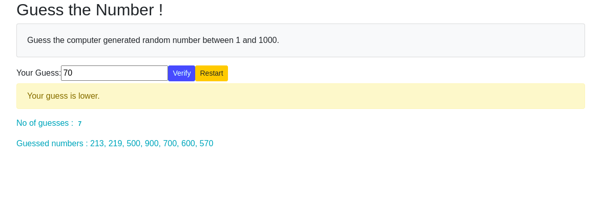

# Angular Guess the Number
I wanted to keep things simple, but still showcase Angular framework's capabilities. 

The objective of the game is to guess a random computer-generated number in as few tries as possible.

This is how the game looks:

# How the Guess the Number works
1. Game generates a  random number between 1 and 1000.
2. Records the trial number the player is on. Starts at 0.
3. Game provides the player with a way to guess what the generate number is.
4. Once a guess has been submitted, the game checks whether it is the correct number.
5. Next, game records the guessed number so the user can see their previous guesses.
6. If it is correct:
    1. Game displays congratulations message.
    2. Game stops the player from being able to enter more guesses.
7. If it is wrong:
    1. The game tells the player they are wrong and whether their guess was too high or too low.
    3. The game allows them to enter another guess.
    4. Game increments the trials number by 1.